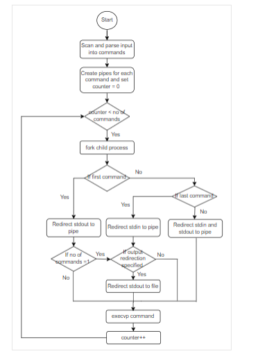

# PipeExplorer

A utility program to explore the use of pipes in C to facilitate inter-process communication (IPC) between a parent and child process. It demonstrates how data can be passed through a pipe from one process to another, showcasing the fundamental concepts of reading and writing via a pipe. The program forks a child process, which sends data (such as a string or numerical value) through the pipe, and the parent process reads and displays it. This simple utility helps users understand how to establish communication between processes using pipes, including how to handle the creation, usage, and closing of pipes.

### Flowchart

### Routines used in the program

fork(): The fork() system call creates a new process by duplicating the calling process. The
new process is referred to as the child process. The calling process is referred to as the
parent process.

pipe(): The pipe() system call creates a pipe, a unidirectional data channel that can be used
for interprocess communication. The array pipefd is used to return two file descriptors
referring to the ends of the pipe. pipefd[0] refers to the read end of the pipe. pipefd[1]
refers to the write end of the pipe.

execvp(): execvp() system call duplicate the actions of the shell in searching for an
executable.

open(): The open() system call opens the file specified by pathname.

close(): The close() system call closes a file descriptor, so that it no longer refers to any file
and may be reused.

perror(): The perror() function produces a message on standard error describing the last
error encountered during a call to a system or library function.

fgets(): It reads a line from the specified stream and stores it into the string pointer.

strlen(): The strlen() function calculates the length of the string, excluding the terminating
null character.

strcmp(): The strcmp() compares two strings character by character. If the strings are equal,
the function returns 0.

strtok(): The strtok() function breaks string into a series of tokens using the delimiter.

wait(): The wait() system call blocks the calling process until one of its child processes exits
or a signal is received. After child process terminates, parent continues its execution after
wait system call instruction.

dup2(): The dup2() system function is used to create a copy of an existing file descriptor.

parseInputString(): This function is used parse the input command to extract the
commands, flags, and input/output file name.

### Implementation details

The program uses fork(), pipe() and execvp() system calls to implement interprocess
communication between processes. Child processes are created using fork() system call, to
execute the commands provided by the user using execvp() function.

The program is developed using C and is implemented as follows:

1.  On running the program, the user will be prompted to enter input, the scanned input is
    then parsed into separate commands.
2.  Pipes are created using pipe() system call to implement interprocess communication
    between processes.
3.  Fork() system call is used to create child process to execute each command in the input.
4.  Redirection of standard input/output of processes is achieved using dup2(). Commands
    are executed by the child process created using execvp() function.
5.  Output is redirected to the file, if specified by the user in the input. The parent process
    waits for the child process to terminate using wait() system call.

### Testing

Requirements:

Compiler : GNU C
System: Linux OS - Ubuntu

Follow the below instructions to run the program:

    Step 1: Open terminal.
    Step 2: Compile and build source code.
        Command: gcc -o mysh myShell.c
    Step 3: Run the executable/object file.
        Command: ./mysh

### Example testcase

Test case 1:
Command: cat country.txt | head -7 | tail -5 | sort | more
